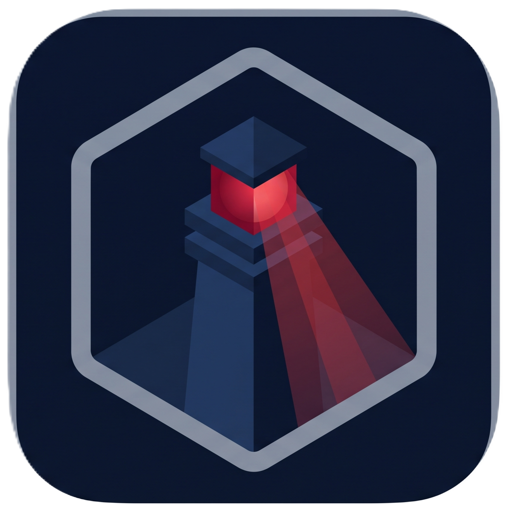
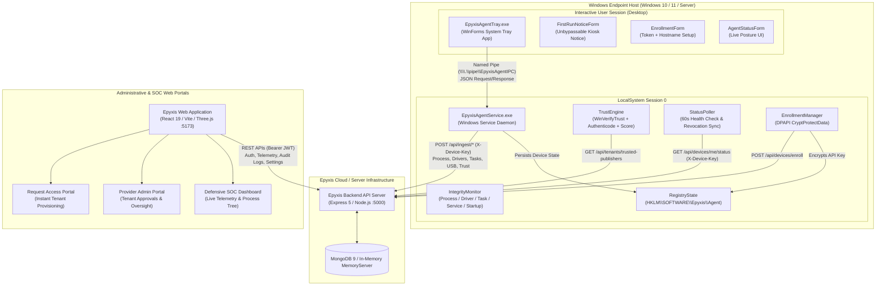
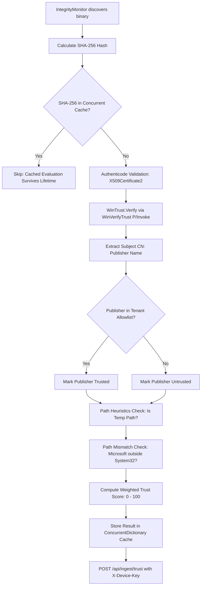
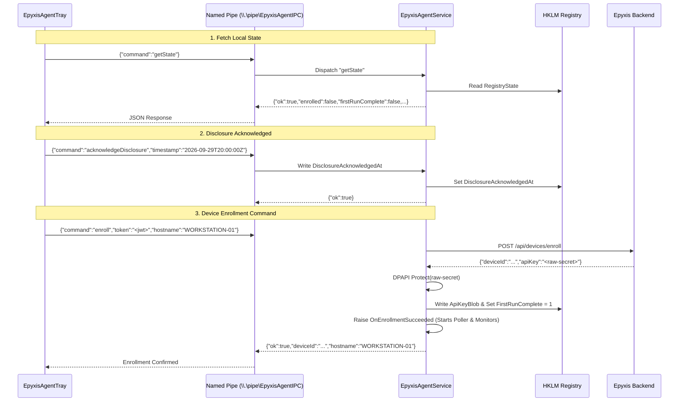
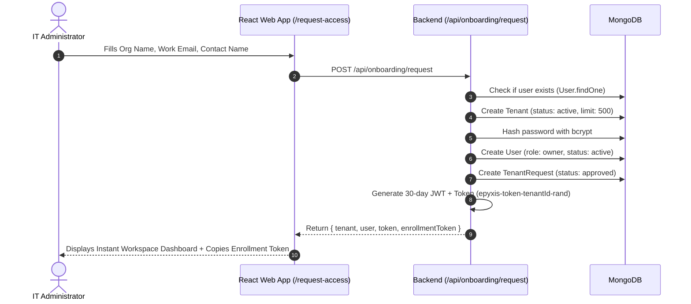
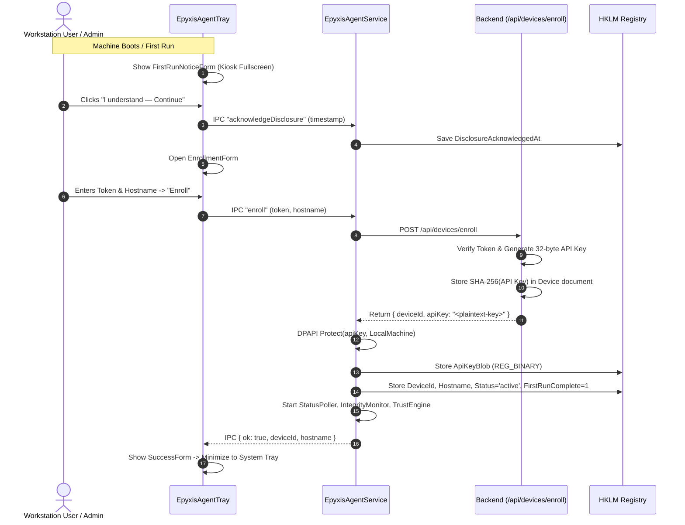
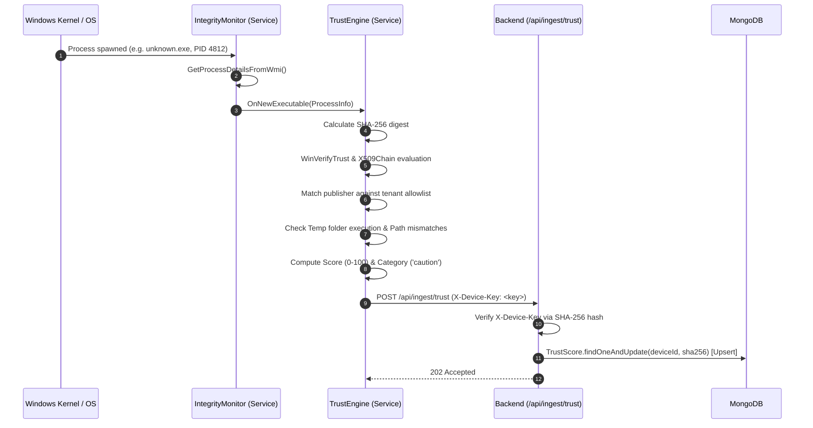

<p align="center">
  
</p>

<h1 align="center">Epyxis Precision Endpoint Security</h1>

<p align="center">
  <strong>Zero-Trust Endpoint Governance, Windows Host Hardening, & Multi-Tenant SaaS Platform</strong>
</p>

<p align="center">
  
  
  
  
  
  
  
  
</p>

---

## Table of Contents

- [1. Executive System Overview](#1-executive-system-overview)
- [2. System Architecture & Component Topography](#2-system-architecture--component-topography)
  - [2.1 Architecture Diagram](#21-architecture-diagram)
  - [2.2 Sub-System Boundaries & Communications](#22-sub-system-boundaries--communications)
- [3. Epyxis Windows Endpoint Agent (`epyxis-agent`)](#3-epyxis-windows-endpoint-agent-epyxis-agent)
  - [3.1 Architecture: Service vs. Tray Decoupling](#31-architecture-service-vs-tray-decoupling)
  - [3.2 Windows Service Daemon (`EpyxisAgentService`)](#32-windows-service-daemon-epyxisagentservice)
  - [3.3 Integrity Monitor Module (`IntegrityMonitor.cs`)](#33-integrity-monitor-module-integritymonitorcs)
  - [3.4 Application Trust Engine (`TrustEngine.cs`)](#34-application-trust-engine-trustenginecs)
  - [3.5 Cryptographic Key Security & Windows DPAPI (`EnrollmentManager.cs`)](#35-cryptographic-key-security--windows-dpapi-enrollmentmanagercs)
  - [3.6 Local Registry State Schema (`RegistryState.cs`)](#36-local-registry-state-schema-registrystatecs)
  - [3.7 Inter-Process Communication Pipe Protocol (`IpcServer.cs` / `IpcClient.cs`)](#37-inter-process-communication-pipe-protocol-ipcservercs--ipcclientcs)
  - [3.8 Transparency UI & Kiosk-Grade Disclosure (`EpyxisAgentTray`)](#38-transparency-ui--kiosk-grade-disclosure-epyxisagenttray)
  - [3.9 Agent Build & Packaging Specifications](#39-agent-build--packaging-specifications)
- [4. Epyxis Backend Core Service (`epyxis-backend`)](#4-epyxis-backend-core-service-epyxis-backend)
  - [4.1 Server Lifecycle & In-Memory MongoDB Fallback](#41-server-lifecycle--in-memory-mongodb-fallback)
  - [4.2 Data Models & Schema Design](#42-data-models--schema-design)
  - [4.3 Authentication & Authorization Middleware](#43-authentication--authorization-middleware)
  - [4.4 RESTful API Reference](#44-restful-api-reference)
    - [4.4.1 Authentication Endpoints (`/api/auth`)](#441-authentication-endpoints-apiauth)
    - [4.4.2 Device Enrollment & Governance (`/api/devices`)](#442-device-enrollment--governance-apidevices)
    - [4.4.3 Device Telemetry Ingest Pipeline (`/api/ingest`)](#443-device-telemetry-ingest-pipeline-apiingest)
    - [4.4.4 SOC Dashboard Aggregations (`/api/dashboard`)](#444-soc-dashboard-aggregations-apidashboard)
    - [4.4.5 Tenant Onboarding & Self-Service (`/api/onboarding` & `/api/provisioning`)](#445-tenant-onboarding--self-service-apionboarding--apiprovisioning)
    - [4.4.6 Provider Oversight Administration (`/api/provider`)](#446-provider-oversight-administration-apiprovider)
    - [4.4.7 Team Governance & Audit Trail (`/api/team`)](#447-team-governance--audit-trail-apiteam)
    - [4.4.8 Tenant Policies & Publisher Allowlist (`/api/tenants`)](#448-tenant-policies--publisher-allowlist-apitenants)
- [5. Epyxis Frontend Web Application (`epyxis-app`)](#5-epyxis-frontend-web-application-epyxis-app)
  - [5.1 Technology Stack & Render Pipeline](#51-technology-stack--render-pipeline)
  - [5.2 Routing Topology](#52-routing-topology)
  - [5.3 WebGL 3D Kinetic Sculpture Engine](#53-webgl-3d-kinetic-sculpture-engine)
  - [5.4 Role-Based Access Control Matrix (`RbacContext.jsx`)](#54-role-based-access-control-matrix-rbaccontextjsx)
  - [5.5 Defensive Security Operations Center (SOC)](#55-defensive-security-operations-center-soc)
  - [5.6 Cryptographic Audit Ledger & Merkle Verification Engine](#56-cryptographic-audit-ledger--merkle-verification-engine)
  - [5.7 Multi-Vector Algorithmic Threat Risk Scoring](#57-multi-vector-algorithmic-threat-risk-scoring)
  - [5.8 Compliance Audit Report Generator](#58-compliance-audit-report-generator)
- [6. Privacy Architecture & Ethical Monitoring Principles](#6-privacy-architecture--ethical-monitoring-principles)
  - [6.1 The Non-Invasive Telemetry Contract](#61-the-non-invasive-telemetry-contract)
  - [6.2 Monitored vs. Prohibited Data Matrix](#62-monitored-vs-prohibited-data-matrix)
- [7. Complete End-to-End System Workflows](#7-complete-end-to-end-system-workflows)
  - [7.1 Self-Service Tenant Provisioning Flow](#71-self-service-tenant-provisioning-flow)
  - [7.2 Device Enrollment & Key Exchange Flow](#72-device-enrollment--key-exchange-flow)
  - [7.3 Executable Trust Evaluation & Ingest Pipeline](#73-executable-trust-evaluation--ingest-pipeline)
  - [7.4 Device Revocation Lifecycle](#74-device-revocation-lifecycle)
- [8. Configuration & Environment Variables](#8-configuration--environment-variables)
- [9. Installation, Development & Operational Commands](#9-installation-development--operational-commands)
  - [9.1 Prerequisites](#91-prerequisites)
  - [9.2 Single-Command Full-System Launch](#92-single-command-full-system-launch)
  - [9.3 Independent Service Execution](#93-independent-service-execution)
- [10. Repository Directory Structure](#10-repository-directory-structure)
- [11. Security Implementation & Defensive Hardening](#11-security-implementation--defensive-hardening)

---

## 1. Executive System Overview

**Epyxis** is an enterprise-grade, multi-tenant endpoint governance and defensive security platform engineered to resolve the operational tension between organizational endpoint visibility and end-user personal privacy.

Unlike traditional enterprise spyware or invasive endpoint management tooling, Epyxis enforces an immutable boundary: **it audits system posture, software integrity, and hardware interfaces without capturing keystroke content, screen buffers, browsing history, or personal files**.

### Primary Problems Solved

1. **Hardware-Tied Device Identity & Key Storage**: Eliminates credentials stored in plaintext or roaming user profiles by cryptographically anchoring device authentication tokens to the Windows physical machine using the **Data Protection API (DPAPI)** in `LocalMachine` scope.
2. **Deterministic Code-Signing Verification**: Integrates deeply with the Windows cryptographic subsystem (`WinVerifyTrust` via P/Invoke and .NET `X509Chain`) to dynamically score and classify every running binary according to Authenticode validity, tenant-defined publisher allowlists, and execution path heuristics.
3. **Hardware-Level USB Threat Neutralization**: Monitors connected USB Human Interface Devices (HIDs) to protect workstations from malicious HID emulation attacks (BadUSB / Rubber Ducky) through strict Vendor ID (VID) and Product ID (PID) fingerprinting.
4. **Frictionless Multi-Tenant SaaS Operation**: Provides instant self-service workspace provisioning alongside enterprise approval workflows, isolating tenant data at rest via MongoDB compound indexing and strict tenant-scoped querying.
5. **Tamper-Evident Security Auditability**: Implements a continuous cryptographic Merkle-chained SHA-256 audit ledger, ensuring that administrative actions (process termination, device revocation, policy modifications) cannot be repudiated or modified retroactively.

---

## 2. System Architecture & Component Topography

The Epyxis ecosystem is distributed across three decoupled sub-projects:

1. **`epyxis-agent`**: A dual-process Windows application written in C# (.NET 8) comprising an elevated background Windows Service daemon (`EpyxisAgentService`) running under `LocalSystem`, and an interactive user-mode System Tray transparency application (`EpyxisAgentTray`) communicating exclusively over secure Named Pipes.
2. **`epyxis-backend`**: A Node.js/Express 5 REST API microservice backed by MongoDB (with an automatic zero-dependency in-memory fallback), providing high-throughput telemetry ingestion, JWT authentication, tenant isolation, and administrative control planes.
3. **`epyxis-app`**: A reactive web application built with React 19, Vite, and Tailwind CSS v4, featuring a 3D WebGL kinetic sculpture powered by Three.js, real-time SOC dashboard telemetry, and interactive role-based access control.

### 2.1 Architecture Diagram



### 2.2 Sub-System Boundaries & Communications

| Communication Channel | Source | Destination | Protocol / Auth | Purpose |
| :--- | :--- | :--- | :--- | :--- |
| **Local Named Pipe** | `EpyxisAgentTray` | `EpyxisAgentService` | `\\.\pipe\EpyxisAgentIPC`<br/>Restricted DACL (LocalSystem + Builtin Users) | Inter-process commands: `getState`, `acknowledgeDisclosure`, `enroll`. |
| **Local Registry** | `EpyxisAgentService` | Windows Registry | `HKLM\SOFTWARE\Epyxis\Agent`<br/>Read-only for Tray, Write for Service | Persists machine enrollment metadata, disclosure acknowledgment, and DPAPI key blob. |
| **Agent Ingestion** | `EpyxisAgentService` | `epyxis-backend` | HTTP/1.1 REST<br/>`X-Device-Key: <plaintext-key>` | Ingests process snapshots, startup changes, USB events, behavior metrics, and trust scores. |
| **Agent Status Poll** | `StatusPoller` | `epyxis-backend` | HTTP/1.1 REST<br/>`X-Device-Key: <plaintext-key>` | Periodic (60s) check-in to verify endpoint status (`active` vs. `revoked`) and update `lastSeenAt`. |
| **Web App Telemetry** | `epyxis-app` | `epyxis-backend` | HTTP/1.1 REST<br/>`Authorization: Bearer <jwt>` | Powers the live SOC dashboard, tenant administration, audit log queries, and team invites. |

---

## 3. Epyxis Windows Endpoint Agent (`epyxis-agent`)

The Windows Endpoint Agent resides in `o:\EpyXis\epyxis-agent` and is compiled as a unified Visual Studio solution (`EpyxisAgent.sln`) targeting **.NET 8.0 on Windows (`net8.0-windows`)**.

### 3.1 Architecture: Service vs. Tray Decoupling

Windows architecture strictly separates Session 0 (non-interactive Windows Services) from interactive user sessions (Session 1+). Attempting to display user interfaces or notification icons directly from a service is blocked by Windows Session 0 Isolation.

Epyxis solves this via a robust two-tier decoupled pattern:
1. **`EpyxisAgentService`**: Runs continuously as a Windows Service under `NT AUTHORITY\LocalSystem`. It possesses elevated OS privileges necessary to read kernel drivers, query WMI, inspect service controllers, access system run keys, and write to `HKLM`.
2. **`EpyxisAgentTray`**: Runs in the interactive desktop user session as standard user privilege. It renders the system tray icon, mandatory onboarding disclosure notices, and transparent status windows. It has zero capability to alter security state directly; all actions are proxied via named pipes to the service.

### 3.2 Windows Service Daemon (`EpyxisAgentService`)

The service host entry point is defined in [Program.cs](./epyxis-agent/EpyxisAgentService/Program.cs), configuring a Microsoft Extensions Generic Host with `.UseWindowsService()`:

```csharp
Host.CreateDefaultBuilder(args)
    .UseWindowsService(options => {
        options.ServiceName = "EpyxisAgentService";
    })
    .ConfigureServices(services => {
        services.AddHostedService<AgentService>();
    })
    .Build()
    .Run();
```

[AgentService.cs](./epyxis-agent/EpyxisAgentService/AgentService.cs) manages the lifecycle of four core operational engines:
- `IpcServer`: Launches the named pipe listener for tray communication.
- `StatusPoller`: Starts status polling against the backend once the device is enrolled.
- `IntegrityMonitor`: Manages periodic system inspection cycles.
- `TrustEngine`: Listens for discovered executables to calculate zero-trust scores.

When enrollment occurs dynamically through the tray app, `IpcServerEvents.OnEnrollmentSucceeded` triggers `StatusPoller`, `IntegrityMonitor`, and `TrustEngine` without requiring a service restart.

### 3.3 Integrity Monitor Module (`IntegrityMonitor.cs`)

Located at [IntegrityMonitor.cs](./epyxis-agent/EpyxisAgentService/Modules/IntegrityMonitor.cs), this module performs cyclic telemetry polling across five OS subsystems every **5 minutes** (`PollInterval = TimeSpan.FromMinutes(5)`):

#### 1. Process Enumeration
- Uses `System.Diagnostics.Process.GetProcesses()` combined with WMI (`SELECT ProcessId, ParentProcessId, ExecutablePath FROM Win32_Process`) to map parent-child process hierarchies (PID and PPID).
- **Snapshot vs. Delta Tracking**: On the initial cycle, all processes are transmitted as `process_snapshot` events with a monotonic `snapshotSeq`. On subsequent cycles, new PIDs trigger `process_start`, while terminated processes emit `process_stop`.
- Discovered executable image paths trigger the `OnNewExecutable` event, directly invoking the `TrustEngine`.

#### 2. Startup Entry Enumeration
- Inspects Registry Run keys:
  - `HKCU\Software\Microsoft\Windows\CurrentVersion\Run`
  - `HKLM\Software\Microsoft\Windows\CurrentVersion\Run`
- Inspects File System Startup Folders:
  - `CSIDL_STARTUP` (`%APPDATA%\Microsoft\Windows\Start Menu\Programs\Startup`)
  - `CSIDL_COMMON_STARTUP` (`%ALLUSERSPROFILE%\Microsoft\Windows\Start Menu\Programs\Startup`)
- Detects new and removed startup persistence items (`startup_snapshot`, `startup_added`, `startup_removed`).

#### 3. Windows Services Enumeration
- Uses `System.ServiceProcess.ServiceController.GetServices()` to monitor state transitions (`Running`, `Stopped`, `StartPending`).
- Queries `Win32_Service` via WMI to correlate service names with display names, startup types (`Automatic`, `Manual`, `Disabled`), and binary paths (`PathName`).

#### 4. Scheduled Tasks Enumeration
- Executes `schtasks.exe /query /fo csv /v` via `ProcessStartInfo` to enumerate tasks registered in Task Scheduler.
- Extracts `TaskName`, `Status`, `TaskPath`, and binary actions while omitting user-specific task arguments.

#### 5. Kernel Driver Enumeration
- Queries WMI `SELECT Name, DisplayName, State, PathName FROM Win32_SystemDriver`.
- Tracks active `.sys` kernel driver modules and detects newly loaded or modified kernel drivers.

#### Command-Line Redaction Engine (`RedactArgs`)
To prevent accidental capture of sensitive credentials (tokens, connection strings, API keys) passed on the command line:
- IntegrityMonitor extracts the executable path exclusively, discarding argument tokens.
- Runs targeted regex filters against path-like strings to sanitize potential credential patterns:
  - `(?i)(--|/)?(password|passwd|pwd|secret|token|apikey|api_key|key|credential|cred|auth|bearer)\s*[=:]\s*\S+`
  - `(?i)^[A-Z_]+(PASSWORD|TOKEN|SECRET|KEY|CREDENTIAL)=.+$`

### 3.4 Application Trust Engine (`TrustEngine.cs`)

Located at [TrustEngine.cs](./epyxis-agent/EpyxisAgentService/Modules/TrustEngine.cs), this module calculates a continuous zero-trust score (0–100) for every distinct executable image.

#### Evaluation Pipeline



#### Scoring Deductions & Categorization

The Trust Engine starts with a perfect score of **100** and applies deterministic penalizations based on verification outcomes:

$$\text{Trust Score} = 100 - \sum \text{Deductions}$$

| Condition | Deduction | Rationale |
| :--- | :---: | :--- |
| **Binary is Unsigned** (`!isSigned`) | **-40** | Binary lacks an embedded Authenticode digital signature. |
| **Invalid Certificate Chain** (`isSigned && !signatureValid`) | **-50** | Certificate is self-signed, untrusted root, or revoked. More severe than unsigned. |
| **Untrusted Publisher** (`signatureValid && !publisherTrusted`) | **-15** | Signature is valid, but publisher CN is absent from the tenant's allowlist. |
| **Running from Temp Directory** (`runningFromTempPath`) | **-20** | Executed from `%TEMP%`, `%TMP%`, `%LOCALAPPDATA%\Temp`, `%APPDATA%`, or `C:\Users\Public`. |
| **Publisher/Path Mismatch** (`pathMismatch`) | **-15** | Binary claims a Microsoft publisher CN but executes outside `C:\Windows\` or `C:\Program Files\`. |

The final score is clamped between 0 and 100 and classified into three categories:
- **`trusted`**: Score $\ge 80$
- **`caution`**: $40 \le \text{Score} < 80$
- **`untrusted`**: Score $< 40$

#### WinVerifyTrust P/Invoke Integration
The Trust Engine performs authentic Win32 certificate verification against `wintrust.dll`:
```csharp
[DllImport("wintrust.dll", ExactSpelling = true, SetLastError = false, CharSet = CharSet.Unicode)]
private static extern uint WinVerifyTrust(
    IntPtr hwnd,
    [MarshalAs(UnmanagedType.LPStruct)] Guid pgActionID,
    WINTRUST_DATA pWVTData);
```
Using action GUID `WINTRUST_ACTION_GENERIC_VERIFY_V2` (`{00AAC56B-CD44-11d0-8CC2-00C04FC295EE}`), ensuring system catalog signatures and counter-signatures are verified identically to Windows SmartScreen and AppLocker.

#### Dynamic Publisher Allowlist Sync
At startup and refreshed every **6 hours** (`PublisherRefreshInterval`), the Trust Engine calls `GET /api/tenants/trusted-publishers` using its device key. If the network call fails, it retries up to 3 times with exponential backoff before falling back conservatively to an empty allowlist.

### 3.5 Cryptographic Key Security & Windows DPAPI (`EnrollmentManager.cs`)

Located at [EnrollmentManager.cs](./epyxis-agent/EpyxisAgentService/EnrollmentManager.cs), this subsystem guarantees that device API keys are never stored in plaintext on disk:

1. When `EnrollAsync` is called with an enrollment token and hostname, the backend returns a 256-bit cryptographically random plaintext API key.
2. The key is encrypted immediately using `System.Security.Cryptography.ProtectedData`:
   ```csharp
   byte[] cipherBytes = ProtectedData.Protect(
       plainBytes, 
       null, 
       DataProtectionScope.LocalMachine
   );
   ```
3. The encrypted ciphertext blob is written as `REG_BINARY` to:
   `HKLM\SOFTWARE\Epyxis\Agent\ApiKeyBlob`
4. The plaintext byte buffer is explicitly cleared from system RAM:
   ```csharp
   Array.Clear(plainBytes, 0, plainBytes.Length);
   ```
5. **Security Contract**: Because `DataProtectionScope.LocalMachine` relies on machine-specific cryptographic keys derived from the OS hardware state, the registry value **cannot be decrypted if copied off the physical machine**.

### 3.6 Local Registry State Schema (`RegistryState.cs`)

State is centralized under `HKLM\SOFTWARE\Epyxis\Agent` via [RegistryState.cs](./epyxis-agent/EpyxisAgentService/RegistryState.cs):

| Registry Value Name | Type | Written By | Description |
| :--- | :--- | :--- | :--- |
| `FirstRunComplete` | `REG_DWORD` | Service | `1` if disclosure notice acknowledged and device enrolled; else `0`. |
| `DisclosureAcknowledgedAt` | `REG_SZ` | Service | ISO-8601 UTC timestamp recorded when the user accepted the disclosure modal. |
| `DeviceId` | `REG_SZ` | Service | MongoDB ObjectId identifier assigned by backend during enrollment. |
| `Hostname` | `REG_SZ` | Service | Registered workstation hostname label. |
| `TenantId` | `REG_SZ` | Service | Scoped organization tenant ID. Backfilled on first status poll. |
| `Status` | `REG_SZ` | Service | Device operational state: `"active"` or `"revoked"`. |
| `EnrolledAt` | `REG_SZ` | Service | ISO-8601 UTC timestamp of original device registration. |
| `LastSeenAt` | `REG_SZ` | Service | ISO-8601 UTC timestamp of the most recent successful poll. |
| `ApiKeyBlob` | `REG_BINARY` | Service | DPAPI `LocalMachine`-encrypted binary payload holding the API key. |

### 3.7 Inter-Process Communication Pipe Protocol (`IpcServer.cs` / `IpcClient.cs`)

The service hosts a Named Pipe server at `\\.\pipe\EpyxisAgentIPC`.

#### Security DACL Enforcement
Access to the named pipe is locked down using `PipeSecurity` to permit exactly two SIDs:
- `NT AUTHORITY\LocalSystem` (`LocalSystemSid`): Full Control.
- `BUILTIN\Users` (`BuiltinUsersSid`): Read and Write permissions (allowing the interactive tray user to connect).
- All network, remote, or anonymous access is explicitly denied.

#### Message Protocol
Over a byte-mode pipe stream, communication utilizes **single-line, newline-delimited UTF-8 JSON**. Each client connection sends one JSON command, receives one JSON response, and terminates.



### 3.8 Transparency UI & Kiosk-Grade Disclosure (`EpyxisAgentTray`)

Located in `EpyxisAgentTray`, this WinForms application delivers a clear, respectful user experience.

#### Mandatory Kiosk Disclosure Notice (`FirstRunNoticeForm.cs`)
On the first execution (when `FirstRunComplete != 1`), the agent displays an unbypassable full-screen notification:
- **Chrome Suppression**: `FormBorderStyle = FormBorderStyle.None`, `WindowState = FormWindowState.Maximized`, `TopMost = true`, `ControlBox = false`, `ShowInTaskbar = false`.
- **Key Interception**: Suppresses `Alt+F4` and `Escape` via `KeyPreview` and overrides `WndProc` to ignore `SC_CLOSE` system commands.
- **Explicit Consent**: The user must review the exact monitoring boundaries before clicking **"I understand — Continue"**. The UTC timestamp of this user action is captured, passed through the IPC pipe, stored in `HKLM`, and sent to the cloud backend as `disclosureAcknowledgedAt`.

#### Additional Tray Forms
- **`EnrollmentForm.cs`**: Clean dialog allowing the administrator or technician to paste an enrollment token and verify the device hostname.
- **`SuccessForm.cs`**: Modern confirmation modal showing registration completion.
- **`AgentStatusForm.cs`**: Accessible from the tray icon menu. Displays real-time device posture: enrollment status (`ACTIVE` vs `REVOKED`), device ID, tenant ID, registration date, and last check-in timestamp.
- **`MonitoringInfoForm.cs`**: Transparent documentation dialog outlining the non-invasive data boundaries.
- **`TrayApp.cs`**: Hosts the persistent `NotifyIcon` in the Windows taskbar tray. Right-click options: *What Epyxis monitors*, *Agent status*, and *Contact your IT administrator*. In compliance with security policy, **no pause or disable option exists in user space** (revocation is centrally managed by tenant administrators).

### 3.9 Agent Build & Packaging Specifications

#### Service Project (`EpyxisAgentService.csproj`)
```xml
<Project Sdk="Microsoft.NET.Sdk.Worker">
  <PropertyGroup>
    <TargetFramework>net8.0-windows</TargetFramework>
    <Nullable>enable</Nullable>
    <ImplicitUsings>disable</ImplicitUsings>
    <AssemblyName>EpyxisAgentService</AssemblyName>
    <UseWindowsService>true</UseWindowsService>
  </PropertyGroup>
  <ItemGroup>
    <PackageReference Include="Microsoft.Extensions.Hosting.WindowsServices" Version="8.0.0" />
    <PackageReference Include="System.Management" Version="8.0.0" />
    <PackageReference Include="System.Security.Cryptography.ProtectedData" Version="8.0.0" />
    <PackageReference Include="System.Text.Json" Version="8.0.5" />
  </ItemGroup>
</Project>
```

#### Tray Application (`EpyxisAgentTray.csproj`)
```xml
<Project Sdk="Microsoft.NET.Sdk">
  <PropertyGroup>
    <TargetFramework>net8.0-windows</TargetFramework>
    <OutputType>WinExe</OutputType>
    <AssemblyName>EpyxisAgentTray</AssemblyName>
    <UseWindowsForms>true</UseWindowsForms>
    <ApplicationIcon>Resources\EpyxisIcon.ico</ApplicationIcon>
  </PropertyGroup>
  <ItemGroup>
    <PackageReference Include="System.Text.Json" Version="8.0.5" />
  </ItemGroup>
</Project>
```

---

## 4. Epyxis Backend Core Service (`epyxis-backend`)

The Epyxis backend service is implemented in Node.js using **Express 5.2.1** and **Mongoose 9.8.1**, located in `o:\EpyXis\epyxis-backend`.

### 4.1 Server Lifecycle & In-Memory MongoDB Fallback

Database connectivity is managed by [db.js](./epyxis-backend/src/config/db.js):
1. **Primary Connection**: Attempts connection to `process.env.MONGO_URI` with a 5000ms server selection timeout.
2. **In-Memory Fallback Engine**: If `MONGO_URI` is unset or fails to connect, the server catches the failure and spins up a dedicated `mongodb-memory-server` instance dynamically. This enables running the entire platform locally with zero external database dependencies.

The HTTP application entry point [index.js](./epyxis-backend/index.js) mounts security middleware:
- `helmet()`: HTTP header protection.
- `cors()`: Cross-Origin Resource Sharing.
- `express.json()`: Body parser.
- Central route mounts: `/api/auth`, `/api/provisioning`, `/api/devices`, `/api/ingest`, `/api/dashboard`, `/api/onboarding`, `/api/provider`, `/api/team`, `/api/tenants`.

### 4.2 Data Models & Schema Design

#### 1. `Tenant` ([Tenant.js](./epyxis-backend/src/models/Tenant.js))
Represents an isolated organizational workspace.
- `name` (String, required): Organization name.
- `domain` (String): Corporate domain.
- `planTier` (String, e.g. "Enterprise Open Source").
- `endpointLimit` (Number, default 100-500).
- `status` (Enum: `active`, `suspended`, `pending`, default `pending`).
- `securityPolicy` (Object):
  - `passwordMinLength` (Number, default 8).
  - `mfaRequired` (Boolean, default false).
  - `sessionTimeoutMinutes` (Number, default 60).
  - `trustedPublishers` (Array of Strings, default: `Microsoft Corporation`, `Microsoft Windows`, `Microsoft Windows Publisher`, `Google LLC`, `Apple Inc.`).
- `createdFromRequestId` (ObjectId, ref: `TenantRequest`).

#### 2. `User` ([User.js](./epyxis-backend/src/models/User.js))
Tenant members, analysts, and administrators.
- `tenantId` (ObjectId, ref: `Tenant`, required).
- `name`, `email`, `username` (Strings, required).
- `passwordHash` (String, bcrypt salt rounds = 10).
- `role` (Enum: `owner`, `admin`, `analyst`, `viewer`, default `viewer`).
- `mustResetPassword` (Boolean, default false).
- `tempPasswordExpiresAt` (Date): Enforces 72-hour temporary password expiration.
- `googleEmail`, `isGoogleLinked` (String, Boolean): Firebase Google SSO linking state.
- `status` (Enum: `invited`, `active`, `disabled`, default `invited`).
- **Compound Indexes**:
  - `{ tenantId: 1, email: 1 }` (unique)
  - `{ tenantId: 1, username: 1 }` (unique)

#### 3. `Device` ([Device.js](./epyxis-backend/src/models/Device.js))
Enrolled endpoint workstations.
- `tenantId` (ObjectId, ref: `Tenant`, required, indexed).
- `hostname` (String, required).
- `enrolledBy` (ObjectId, ref: `User`, required).
- `apiKeyHash` (String, required, indexed): SHA-256 hash of the 32-byte hexadecimal device secret.
- `status` (Enum: `active`, `revoked`, default `active`).
- `enrolledAt`, `lastSeenAt` (Dates).
- `disclosureAcknowledgedAt` (Date): Server-side verifiable proof of employee privacy notice acceptance.

#### 4. `TrustScore` ([TrustScore.js](./epyxis-backend/src/models/TrustScore.js))
Evaluated software binaries per endpoint.
- `tenantId`, `deviceId` (ObjectIds, required).
- `sha256` (String, required): 64-character lowercase hex digest.
- `isSigned`, `signatureValid` (Booleans).
- `publisherName` (String), `publisherTrusted` (Boolean).
- `runningFromTempPath`, `pathMismatch` (Booleans).
- `score` (Number: 0–100), `category` (Enum: `trusted`, `caution`, `untrusted`).
- `executablePath` (String, max 2048 chars).
- `evaluatedAt` (Date, default `Date.now`).
- **Compound Unique Index**: `{ deviceId: 1, sha256: 1 }` (ensures idempotency).

#### 5. `DeviceEvent` ([DeviceEvent.js](./epyxis-backend/src/models/DeviceEvent.js))
Ingested operating system events.
- `tenantId`, `deviceId` (ObjectIds, required).
- `eventType` (String): e.g. `process_snapshot`, `process_start`, `process_stop`, `startup_snapshot`, `service_snapshot`, `driver_snapshot`.
- `payload` (Object): Whitelisted event-specific metadata.
- `createdAt` (Date, indexed).

#### 6. `UsbEvent` ([UsbEvent.js](./epyxis-backend/src/models/UsbEvent.js))
Hardware connection audit events.
- `tenantId`, `deviceId` (ObjectIds, required).
- `vendorId` (String), `productId` (String).
- `deviceClass` (String, e.g. "HID Mouse / Keyboard", "Hardware Encrypted Storage").
- `serialNumber` (String).
- `trusted` (Boolean, default false).
- `firstSeenAt`, `createdAt` (Dates).

#### 7. `BehaviorMetric` ([BehaviorMetric.js](./epyxis-backend/src/models/BehaviorMetric.js))
User activity cadence tracking.
- `tenantId`, `deviceId` (ObjectIds, required).
- `userSessionDate` (Date).
- `activeAppSeconds`, `focusSwitchCount` (Numbers).
- `keyboardActivityCount` (Number, default 0): **Strictly the count of keystrokes—never character values or textual content**.

#### 8. `AuditLog` ([AuditLog.js](./epyxis-backend/src/models/AuditLog.js))
Immutable compliance audit records.
- `tenantId` (ObjectId, ref: `Tenant`, required).
- `actorUserId` (ObjectId, ref: `User`).
- `action` (String): e.g. `device_enrolled`, `device_revoked`, `tenant_approved`, `password_reset_completed`.
- `targetUserId` (ObjectId, ref: `User`).
- `metadata` (Mixed Object).

#### 9. `ProviderUser` ([ProviderUser.js](./epyxis-backend/src/models/ProviderUser.js))
Root platform administrators with global oversight capabilities.

#### 10. `TenantRequest` ([TenantRequest.js](./epyxis-backend/src/models/TenantRequest.js))
Enterprise onboarding requests awaiting provider review.

#### 11. `Alert` ([Alert.js](./epyxis-backend/src/models/Alert.js))
Security alerts categorized by severity (`low`, `medium`, `high`, `critical`).

### 4.3 Authentication & Authorization Middleware

Defined across [authMiddleware.js](./epyxis-backend/src/middleware/authMiddleware.js) and [deviceAuthMiddleware.js](./epyxis-backend/src/middleware/deviceAuthMiddleware.js):

#### 1. User JWT Protection (`protect`)
- Validates standard `Authorization: Bearer <token>` headers.
- Verifies tokens using `JWT_SECRET` (configured via [jwtConfig.js](./epyxis-backend/src/config/jwtConfig.js)).
- Hydrates `req.user` with tenant boundaries (`tenantId`) and role attributes.

#### 2. Role Enforcement (`admin`)
- Enforces administrative access: requires `req.user.role === 'admin' || req.user.role === 'owner'`.
- Throws HTTP 403 Forbidden on violation.

#### 3. Provider Administrative Protection (`providerProtect`)
- Validates provider tokens and verifies against the `ProviderUser` collection.

#### 4. Hardware Device Key Authentication (`deviceAuth`)
- Inspects incoming requests for the `X-Device-Key` header.
- Computes SHA-256 hash of the header value:
  ```javascript
  const keyHash = crypto.createHash('sha256').update(rawKey).digest('hex');
  ```
- Queries `Device.findOne({ apiKeyHash: keyHash })`.
- **Immediate Revocation Enforcement**: Verifies that `device.status === 'active'`. If revoked, rejects immediately with HTTP 403 Forbidden.
- Fire-and-forgets a timestamp touch on `lastSeenAt`.

### 4.4 RESTful API Reference

#### 4.4.1 Authentication Endpoints (`/api/auth`)

| Method | Endpoint | Access | Request Body | Description |
| :--- | :--- | :--- | :--- | :--- |
| `POST` | `/api/auth/login` | Public | `{ username, password }` | Authenticates a user. Returns JWT token or signals `REQUIRE_RESET` if temporary password must be changed. |
| `POST` | `/api/auth/google-login` | Public | `{ email }` | Authenticates via Google SSO. Auto-links verified Google email to matching workspace user account. |
| `POST` | `/api/auth/link-google` | Public/Auth | `{ userId, email, googleEmail }` | Manually links a Google account to an existing user profile in MongoDB. |
| `POST` | `/api/auth/reset-temp-password` | Public | `{ username, oldPassword, newPassword }` | Changes a temporary password. Enforces 8+ characters, sets `mustResetPassword = false`, activates user, and writes an `AuditLog`. |

#### 4.4.2 Device Enrollment & Governance (`/api/devices`)

| Method | Endpoint | Access | Headers / Parameters | Description |
| :--- | :--- | :--- | :--- | :--- |
| `POST` | `/api/devices/generate-token` | Private (Admin) | Bearer JWT | Generates a 1-hour short-lived enrollment token encoding `tenantId` and `userId`. |
| `POST` | `/api/devices/enroll` | Public (Token Required) | `{ enrollmentToken, hostname, disclosureAcknowledgedAt }` | Validates token, generates a 32-byte cryptographic API key, hashes with SHA-256, registers device, records disclosure timestamp, and returns plaintext key once. |
| `GET` | `/api/devices/me/status` | Device | `X-Device-Key: <key>` | Polled by endpoint agents to update `lastSeenAt` and confirm active/revoked status. |
| `GET` | `/api/devices` | Private | Bearer JWT | Lists all registered devices belonging to the authenticated tenant. |
| `POST` | `/api/devices/:id/revoke` | Private (Admin) | `:id` (Device ObjectId) | Sets `status = 'revoked'` on target device. Causes all subsequent ingest calls to fail immediately. Logs to `AuditLog`. |

#### 4.4.3 Device Telemetry Ingest Pipeline (`/api/ingest`)

All ingestion routes require `X-Device-Key` hardware authentication and enforce strict field whitelisting via the `pick()` validation helper. Unrecognized fields are stripped; missing mandatory fields return HTTP 400.

| Method | Endpoint | Approved Schema Fields | Security Constraints |
| :--- | :--- | :--- | :--- |
| `POST` | `/api/ingest/process` | `eventType`, `pid`, `ppid`, `name`, `execPath`, `startTime`, `publisher`, `signatureStatus`, `snapshotSeq` | `eventType` must be `process_snapshot`, `process_start`, or `process_stop`. PIDs must be positive integers. Arguments are never accepted. |
| `POST` | `/api/ingest/startup` | `eventType`, `hive`, `name`, `execPath`, `snapshotSeq` | `hive` must be `HKCU`, `HKLM`, or `StartupFolder`. `execPath` truncated at 2048 chars. |
| `POST` | `/api/ingest/service` | `eventType`, `serviceName`, `displayName`, `status`, `startType`, `execPath`, `previousStatus`, `snapshotSeq` | Tracks Windows Service state transitions. |
| `POST` | `/api/ingest/scheduledtask` | `eventType`, `taskPath`, `taskName`, `status`, `execPath`, `snapshotSeq` | Task arguments are excluded. Paths validated against length limits. |
| `POST` | `/api/ingest/driver` | `eventType`, `name`, `displayName`, `state`, `pathName`, `snapshotSeq` | Monitors `.sys` kernel driver additions and state changes. |
| `POST` | `/api/ingest/usb` | `vendorId`, `productId`, `deviceClass`, `serialNumber`, `action`, `trusted` | Hardware VID/PID only; raw HID report payloads are rejected. |
| `POST` | `/api/ingest/behavior` | `userSessionDate`, `activeAppSeconds`, `focusSwitchCount`, `keyboardActivityCount` | Counts must be non-negative integers. Keystroke content is strictly rejected. |
| `POST` | `/api/ingest/alerts` | `severity`, `category`, `details` | `severity` restricted to `low`, `medium`, `high`, `critical`. Details truncated to 500 chars to avoid log injection. |
| `POST` | `/api/ingest/trust` | `sha256`, `isSigned`, `signatureValid`, `publisherName`, `publisherTrusted`, `runningFromTempPath`, `pathMismatch`, `score`, `category`, `executablePath` | Upserts trust evaluation by `(deviceId, sha256)`. Requires valid 64-char hex digest and integer score (0–100). |

#### 4.4.4 SOC Dashboard Aggregations (`/api/dashboard`)

- `GET /api/dashboard/stats`: **Public / Real-Time Overview Aggregation**. Computes live aggregate platform metrics across devices, monitored processes, kernel drivers, audited USB peripherals, and active alerts directly from the database without static mock fallbacks.
- `GET /api/dashboard/devices`: Returns all tenant devices sorted by registration date (requires Bearer JWT).
- `GET /api/dashboard/events`: Returns the 100 most recent system events.
- `GET /api/dashboard/trust-scores`: Returns the 100 most recent trust evaluations.
- `GET /api/dashboard/behavior`: Returns recent user activity metrics.
- `GET /api/dashboard/usb`: Returns all audited USB hardware events.
- `GET /api/dashboard/alerts`: Returns active security alerts.

#### 4.4.5 Tenant Onboarding & Self-Service (`/api/onboarding` & `/api/provisioning`)
- `POST /api/onboarding/request`: **Instant self-service workspace provisioning**. Creates a new `Tenant`, generates a default `owner` account, creates an approved `TenantRequest`, and returns a 30-day JWT along with an instant device enrollment token.
- `POST /api/provisioning/tenant`: Alternative administrative provisioning endpoint.

#### 4.4.6 Provider Oversight Administration (`/api/provider`)
Restricted to `ProviderUser` credentials:
- `POST /api/provider/login`: Provider admin authentication.
- `GET /api/provider/requests`: Queries tenant onboarding requests with optional `?status=` filters (`pending`, `approved`, `rejected`, `more_info`).
- `POST /api/provider/requests/:id/notes`: Appends internal administrative notes.
- `POST /api/provider/requests/:id/approve`: Approves a pending request, provisions a `Tenant`, creates an `owner` user with a 72-hour temporary password, and records an `AuditLog`.
- `POST /api/provider/requests/:id/reject`: Rejects a request with an audit explanation.
- `POST /api/provider/requests/:id/more-info`: Requests additional details from the prospective tenant.
- `GET /api/provider/tenants`: Returns cross-tenant overview with aggregated active user counts and endpoint limits.

#### 4.4.7 Team Governance & Audit Trail (`/api/team`)
- `GET /api/team/users`: Lists all users belonging to the tenant.
- `POST /api/team/users`: Invites a new user (`admin`, `analyst`, `viewer`). Generates a temporary password valid for 72 hours, sets `mustResetPassword = true`, and logs the creation.
- `POST /api/team/users/:id/reset`: Forces a temporary password reset on a user.
- `POST /api/team/users/:id/disable`: Sets `status = 'disabled'`, revoking access immediately.
- `GET /api/team/audit-logs`: Fetches tenant-scoped audit records with populated actor and target user profiles.

#### 4.4.8 Tenant Policies & Publisher Allowlist (`/api/tenants`)
- `GET /api/tenants/trusted-publishers`: **Device Endpoint Route** (`X-Device-Key`). Returns the tenant's trusted publisher allowlist for local scoring in `TrustEngine`.
- `GET /api/tenants/settings`: Retrieves tenant profile and security policy defaults (`passwordMinLength`, `mfaRequired`, `sessionTimeoutMinutes`).
- `POST /api/tenants/settings`: Updates tenant security policies and trusted publisher lists (Admin only). Logs changes to `AuditLog`.

---

## 5. Epyxis Frontend Web Application (`epyxis-app`)

The frontend application in `o:\EpyXis\epyxis-app` is a single-page application built on **React 19.2.7**, **Vite 8.1.1**, and **Tailwind CSS v4.3.3**.

### 5.1 Technology Stack & Render Pipeline

- **Framework**: React 19 (`react`, `react-dom`, `react-router-dom` v7).
- **Styling**: Tailwind CSS v4 utilizing `@tailwindcss/vite` without legacy postCSS configs.
- **3D Graphics & Shaders**: Three.js (`three` v0.185.1), `@react-three/fiber` v9.6.1, and `@react-three/drei` v10.7.7.
- **Motion & Smooth Scrolling**: Framer Motion (`framer-motion` v12.42.2), GSAP 3.15 (`gsap`, `ScrollTrigger`), and Lenis Smooth Scroll (`lenis` v1.3.25).
- **Icons**: Lucide React (`lucide-react` v1.27.0).
- **Authentication**: Firebase Client SDK (`firebase` v12.16.0) integrated with custom backend JWT session state.

### 5.2 Routing Topology

Declared in [App.jsx](./epyxis-app/src/App.jsx):

```
/                   -> HomePage (Hero, WebGL Sculpture, Capabilities, Telemetry Preview)
/modules            -> ModulesPage (Detailed Specifications of all 6 Engine Modules)
/architecture       -> ArchitecturePage (10-Node Kernel-to-Cloud System Topology)
/dashboard          -> DashboardPage (SOC Control Center, Capabilities 1-10)
/privacy            -> PrivacyPage (The Ethical Monitoring Contract Matrix)
/experience         -> ExperiencePage (Interactive Step-by-Step Security Walkthrough)
/request-access     -> RequestAccessPage (Self-Service Instant Tenant Provisioning)
/provider-admin     -> ProviderAdminPage (Multi-Tenant Management & Request Approvals)
/login              -> LoginPage (Password Auth, Google SSO, Personas, Temp Reset)
/profile-setup      -> ProfileSetupPage (User Biodata & Google Account Linking)
```

### 5.3 WebGL 3D Kinetic Sculpture Engine

The backdrop of the application renders an interactive 3D WebGL scene managed by [CanvasContainer.jsx](./epyxis-app/src/components/3d/CanvasContainer.jsx) and [KineticSculpture.jsx](./epyxis-app/src/components/3d/KineticSculpture.jsx):
- **Dynamic Geometric Rings**: Nested metallic rings rotating along complementary axes with mouse parallax tracking.
- **Physical Glass Lens**: Rendered using `@react-three/drei`'s `MeshTransmissionMaterial` with dynamic chromatic aberration, thickness, and volumetric distortion.
- **Route-Aware Morphing**: The sculpture smoothly interpolates position, scale, and explosion offsets based on scroll progress and active route (`/modules` explodes rings outward; `/architecture` shifts left; `/privacy` rotates the glass lens forward as a shield; `/dashboard` enters macro focus).

### 5.4 Role-Based Access Control Matrix (`RbacContext.jsx`)

User roles and permissions are defined in [RbacContext.jsx](./epyxis-app/src/context/RbacContext.jsx):

| Permission String | System Provider (Level 1) | Tenant Admin (Level 2) | SOC Analyst (Level 3) | Tenant Member (Level 4) |
| :--- | :---: | :---: | :---: | :---: |
| `PROVISION_TENANT` | ✅ | ❌ | ❌ | ❌ |
| `MANAGE_GLOBAL_TENANTS` | ✅ | ❌ | ❌ | ❌ |
| `CLEAR_AUDIT_LOGS` | ✅ | ❌ | ❌ | ❌ |
| `MANAGE_ORGANIZATION` | ❌ | ✅ | ❌ | ❌ |
| `MANAGE_TENANT_USERS` | ❌ | ✅ | ❌ | ❌ |
| `KILL_PROCESS` | ✅ | ✅ | ✅ | ❌ |
| `DISABLE_PERSISTENCE` | ✅ | ✅ | ❌ | ❌ |
| `MANAGE_USB` | ✅ | ✅ | ✅ | ❌ |
| `VIEW_TELEMETRY` | ✅ | ✅ | ✅ | ✅ |
| `EXPORT_REPORTS` | ✅ | ✅ | ✅ | ✅ |
| `VERIFY_AUDIT_LOGS` | ✅ | ✅ | ✅ | ❌ |

When a user attempts an unauthorized action, `checkPermissionOrGuard()` halts execution and presents [RbacGuardModal.jsx](./epyxis-app/src/components/common/RbacGuardModal.jsx), detailing the required permission and why the user's role is restricted.

### 5.5 Defensive Security Operations Center (SOC)

Managed in [LiveDashboardContent.jsx](./epyxis-app/src/components/dashboard/LiveDashboardContent.jsx), the dashboard provides real-time visibility across 10 security capabilities:

```
[Overview]  [Processes]  [ETW Stream]  [USB Hardware]  [Persistence]  [Drivers]  [Audit Trail]  [Team]  [Settings]  [Reports]
```

1. **Process Hierarchy Tree**: Uses `buildProcessTree()` in [securityEngine.js](./epyxis-app/src/services/securityEngine.js) to convert flat process lists into parent-child visual execution graphs.
2. **Authenticode Certificate Inspector**: Clicking "Inspect Cert" opens [CertificateInspectorModal.jsx](./epyxis-app/src/components/dashboard/CertificateInspectorModal.jsx), displaying Root CA, Intermediate CA, Leaf Subject CN, serial number, and hash algorithms.
3. **ETW Kernel Stream Monitor**: Displays Event Tracing for Windows feeds with real-time streaming toggles and severity filters.
4. **USB HID Hardware Quarantine**: Real-time listing of plugged devices with instant toggle between `Whitelisted` and `Quarantined`.
5. **Startup Persistence Inspector**: Lists registry run values and scheduled tasks with enable/disable administrative toggles.
6. **Kernel Driver Auditor**: Displays loaded `.sys` drivers with WHQL signature badges.

### 5.6 Cryptographic Audit Ledger & Merkle Verification Engine

In [securityEngine.js](./epyxis-app/src/services/securityEngine.js), every administrative action taken in the SOC (process killed, USB quarantined, persistence disabled) is recorded in an immutable ledger:

```javascript
export function createLedgerEntry(prevHash, index, actor, role, action, details, target) {
  const timestamp = new Date().toISOString();
  const rawString = `${index}:${timestamp}:${actor}:${role}:${action}:${details}:${target}:${prevHash}`;
  const hash = pseudoSha256(rawString);
  return { index, timestamp, actor, role, action, details, target, prevHash, hash };
}
```

The genesis block starts with:
`0x0000000000000000000000000000000000000000000000000000000000000000`

Clicking **"Verify SHA-256 Ledger"** invokes `verifyLedgerIntegrity()`, recalculating cryptographic hashes from Block 0 through the latest entry. If any block has been modified or deleted, the verification detects the exact broken index and displays a tamper warning.

### 5.7 Multi-Vector Algorithmic Threat Risk Scoring

The dashboard continuously evaluates an endpoint composite risk score (0–100) across five defensive vectors using `calculateEndpointRiskScore()`:

$$\text{Composite Risk} = \text{ProcRisk} + \text{DriverRisk} + \text{UsbRisk} + \text{PersistRisk} + \text{EventRisk}$$

```
Vector 1: Unsigned Processes        Weight: 25   (12.5 pts per unsigned binary, max 25)
Vector 2: Unverified Drivers         Weight: 25   (12.5 pts per unverified driver, max 25)
Vector 3: Non-Whitelisted USB HIDs   Weight: 20   (10.0 pts per unknown USB device, max 20)
Vector 4: Suspicious Persistence     Weight: 15   (7.5 pts per high-risk startup item, max 15)
Vector 5: Critical ETW Events        Weight: 15   (3.0 pts per Critical/Warning event, max 15)
```

- **0–20**: `Low Risk` (Emerald)
- **21–45**: `Moderate Risk` (Blue)
- **46–75**: `Elevated Risk` (Amber)
- **76–100**: `Critical Threat` (Rose)

### 5.8 Compliance Audit Report Generator

Managed in [AuditReportGenerator.jsx](./epyxis-app/src/components/dashboard/AuditReportGenerator.jsx):
- Generates formal Executive Compliance & Endpoint Audit Reports.
- Includes cryptographic verification proofs, system posture summaries, and hardware inventories.
- Exports audit data directly to CSV format via `exportTelemetryCsv()`.

---

## 6. Privacy Architecture & Ethical Monitoring Principles

### 6.1 The Non-Invasive Telemetry Contract

Epyxis adheres to an explicit design principle: **workplace security does not require mass surveillance**. 

Invasion of privacy introduces severe liability under GDPR, CCPA, and labor regulations. Epyxis proves endpoint integrity purely through executable verification, configuration drift auditing, and hardware fingerprinting.

### 6.2 Monitored vs. Prohibited Data Matrix

| Dimension | What Epyxis Audits (Permitted) | What Epyxis NEVER Audits (Strictly Prohibited) |
| :--- | :--- | :--- |
| **Keyboard Input** | Aggregate count of key presses per session (`keyboardActivityCount`). | Keystroke characters, strings, passwords, or typed content. Zero keylogging. |
| **Display & Media** | Active window title metadata and application focus durations. | Screen recordings, periodic screenshots, webcam feeds, or microphone audio. |
| **Network & Web** | High-level process network port bindings and ETW connection events. | Full URLs, search queries, browser history, cookies, or HTTPS payload bodies. |
| **File System** | Hashes (SHA-256) of executable images, `.dll`, and `.sys` files. | File contents, documents, spreadsheets, source code files, or personal photos. |
| **Communications** | Executable name of running messaging apps (e.g. `Teams.exe`). | Message text, chat transcripts, emails, contact lists, or attachments. |
| **Clipboard** | No clipboard inspection whatsoever. | Clipboard text, copied credentials, images, or pasted buffers. |
| **Location** | Organization-assigned tenant metadata and network origin IP. | Device GPS tracking or continuous physical location profiling. |

---

## 7. Complete End-to-End System Workflows

### 7.1 Self-Service Tenant Provisioning Flow



### 7.2 Device Enrollment & Key Exchange Flow



### 7.3 Executable Trust Evaluation & Ingest Pipeline



### 7.4 Device Revocation Lifecycle

1. Tenant Administrator clicks **"Revoke Device"** in the SOC Dashboard.
2. Web App calls `POST /api/devices/:id/revoke` with Bearer JWT.
3. Backend marks `device.status = 'revoked'` in MongoDB and appends an `AuditLog` entry.
4. Next time the device agent calls any `/api/ingest/*` route:
   - `deviceAuthMiddleware` verifies key hash, detects `status !== 'active'`, and aborts with `HTTP 403 Device is revoked or inactive`.
5. Next time `StatusPoller` fires its 60-second cycle:
   - Calls `GET /api/devices/me/status`.
   - Backend responds with `{"status": "revoked"}`.
   - StatusPoller writes `"Status" = "revoked"` to `HKLM\SOFTWARE\Epyxis\Agent`.
6. When the user opens the tray menu **"Agent status"**, `AgentStatusForm` highlights an orange alert:
   *⚠ This device has been revoked by your IT administrator.*

---

## 8. Configuration & Environment Variables

### Backend Configuration (`epyxis-backend/.env`)

| Variable Name | Required | Default / Fallback | Description |
| :--- | :---: | :--- | :--- |
| `PORT` | Optional | `5000` | Port on which the Express HTTP server listens. |
| `MONGO_URI` | Optional | *MongoMemoryServer instance* | Connection string to MongoDB cluster (e.g. `mongodb://localhost:27017/epyxis`). |
| `JWT_SECRET` | Recommended | `epyxis_jwt_sec_8f94a73b2e61c50d...` | High-entropy secret key for signing user session tokens. |
| `NODE_ENV` | Optional | `development` | Runtime environment mode (`development` vs `production`). |

### Agent Constants (`EpyxisAgentService/AgentConfig.cs`)

| Constant | Hardcoded Default | Operational Purpose |
| :--- | :--- | :--- |
| `BackendBaseUrl` | `http://localhost:5000` | Base URL of the Epyxis Backend server. |
| `PipeName` | `EpyxisAgentIPC` | Named pipe address (`\\.\pipe\EpyxisAgentIPC`). |
| `StatusPollIntervalSeconds`| `60` | Check-in frequency for `StatusPoller` to query `/api/devices/me/status`. |
| `RegistryRoot` | `SOFTWARE\Epyxis\Agent` | Registry location under `HKEY_LOCAL_MACHINE`. |

### Frontend Configuration (`epyxis-app/src/config/firebase.js`)

Firebase initialization parameters for enterprise Google SSO integration. In production release mode, users authenticate via registered enterprise Google accounts or direct workspace email/password credentials, with strict JWT verification and zero mock personas or dummy session fallbacks.

---

## 9. Installation, Development & Operational Commands

### 9.1 Prerequisites

- **Operating System**: Windows 10, Windows 11, or Windows Server 2019/2022 (for full agent support).
- **.NET SDK**: Version **8.0 or later** (`dotnet --version`).
- **Node.js**: Version **18.0 or later** (`node -v`) with `npm`.
- **Git**: For version control.

### 9.2 Single-Command Full-System Launch

The repository includes orchestrated launchers in the root directory that start the Backend on port 5000, Frontend on port 5173, and the Windows Agent Tray app simultaneously.

#### Option A: PowerShell Launcher (Recommended)
```powershell
# Run from repository root:
npm start

# Or directly execute the script:
powershell -ExecutionPolicy Bypass -File .\start-system.ps1

# To launch web tiers without starting the Windows Agent:
powershell -ExecutionPolicy Bypass -File .\start-system.ps1 -SkipAgent
```

#### Option B: Windows Batch Launcher
```cmd
# Run from repository root:
npm run start:bat

# Or double-click:
start-system.bat
```

### 9.3 Independent Service Execution

#### 1. Backend Server
```bash
cd epyxis-backend
npm install
npm run dev
# Server boots at http://localhost:5000
# Automatically mounts MongoMemoryServer if no local MongoDB is running
```

#### 2. Frontend Web Application
```bash
cd epyxis-app
npm install
npm run dev
# Vite dev server runs at http://localhost:5173
```

#### 3. Windows Endpoint Agent

##### Run the Tray Application:
```powershell
cd epyxis-agent
dotnet run --project EpyxisAgentTray/EpyxisAgentTray.csproj
```

##### Run or Debug the Background Service (Console Mode):
```powershell
cd epyxis-agent
dotnet run --project EpyxisAgentService/EpyxisAgentService.csproj
```

##### Install as a Permanent Windows Service (Elevated Administrator PowerShell):
```powershell
# Publish the service binary
cd o:\EpyXis\epyxis-agent\EpyxisAgentService
dotnet publish -c Release -r win-x64 --self-contained false -o C:\EpyxisAgent

# Register with Windows Service Control Manager (SCM)
sc.exe create EpyxisAgentService binPath= "C:\EpyxisAgent\EpyxisAgentService.exe" start= auto

# Start the service
sc.exe start EpyxisAgentService
```

---

## 10. Repository Directory Structure

```
o:\EpyXis
├── EPYXIS.png                          # Master repository banner & architectural visual
├── desktop.mp4                         # Cinematic video background asset for SOC dashboard
├── epyxis_mobile_post.jpg              # Mobile orientation visual asset
├── package.json                        # Root npm workspace configuration & orchestration scripts
├── start-system.bat                    # Windows Batch multi-process launcher
├── start-system.ps1                    # PowerShell multi-process launcher with -SkipAgent support
│
├── epyxis-agent/                       # .NET 8 Windows Endpoint Agent Solution
│   ├── EpyxisAgent.sln                 # Visual Studio multi-project solution
│   ├── EpyxisAgentService/             # Windows Service Daemon Project (LocalSystem)
│   │   ├── EpyxisAgentService.csproj   # Worker SDK project targeting net8.0-windows
│   │   ├── Program.cs                  # Windows Service host bootstrap
│   │   ├── AgentService.cs             # BackgroundService lifecycle & event coordinator
│   │   ├── AgentConfig.cs              # Central service constants (URL, Pipe, Intervals)
│   │   ├── EnrollmentManager.cs        # DPAPI CryptProtectData & /api/devices/enroll handler
│   │   ├── IpcServer.cs                # Secure Named Pipe listener (EpyxisAgentIPC)
│   │   ├── RegistryState.cs            # HKLM\SOFTWARE\Epyxis\Agent read/write abstractions
│   │   ├── StatusPoller.cs             # 60-second periodic /api/devices/me/status poller
│   │   ├── PrivacyEngine.cs            # Strict telemetry DTO serialization boundary
│   │   └── Modules/
│   │       ├── IntegrityMonitor.cs     # Process, Service, Driver, Task, Startup enumerator
│   │       ├── TrustEngine.cs          # WinVerifyTrust & Authenticode zero-trust scorer
│   │       └── ProcessInfo.cs          # Cross-module process metadata contract
│   │
│   └── EpyxisAgentTray/                # WinForms System Tray Desktop Application
│       ├── EpyxisAgentTray.csproj      # WinExe project targeting net8.0-windows
│       ├── Program.cs                  # Desktop application entry point & first-run gate
│       ├── TrayApp.cs                  # NotifyIcon application context & context menu
│       ├── IpcClient.cs                # Named Pipe client communicating with service
│       ├── Forms/
│       │   ├── FirstRunNoticeForm.cs   # Unbypassable fullscreen kiosk disclosure form
│       │   ├── EnrollmentForm.cs       # Token & hostname input dialog
│       │   ├── SuccessForm.cs          # Enrollment success confirmation modal
│       │   ├── AgentStatusForm.cs      # Live endpoint posture & check-in inspector
│       │   └── MonitoringInfoForm.cs   # Transparency disclosure breakdown form
│       └── Resources/
│           └── EpyxisIcon.ico          # Application system tray icon
│
├── epyxis-backend/                     # Node.js & Express 5 Backend Microservice
│   ├── package.json                    # Backend dependencies (express 5, mongoose 9, helmet)
│   ├── index.js                        # Express server entry point & route mounting
│   └── src/
│       ├── config/
│       │   ├── db.js                   # MongoDB connection with MongoMemoryServer fallback
│       │   └── jwtConfig.js            # Centralized high-entropy JWT secret definition
│       ├── middleware/
│       │   ├── authMiddleware.js       # User Bearer JWT protection & admin role guards
│       │   └── deviceAuthMiddleware.js # X-Device-Key SHA-256 hardware auth middleware
│       ├── models/
│       │   ├── Tenant.js               # Multi-tenant organization profile & policies
│       │   ├── User.js                 # Tenant user schema with compound indexes
│       │   ├── Device.js               # Enrolled endpoint hardware schema
│       │   ├── TrustScore.js           # Executable trust evaluation results (upserted by hash)
│       │   ├── DeviceEvent.js          # Generic operating system telemetry events
│       │   ├── UsbEvent.js             # Audited USB device connections
│       │   ├── BehaviorMetric.js       # Count-only user session metrics
│       │   ├── Alert.js                # System security alert schema
│       │   ├── AuditLog.js             # Tenant-scoped immutable audit trail
│       │   ├── ProviderUser.js         # Global system provider credentials
│       │   └── TenantRequest.js        # Onboarding workspace registration requests
│       └── routes/
│           ├── auth.js                 # Password login, Google SSO, temporary reset
│           ├── devices.js              # Token generation, device enrollment, revocation
│           ├── ingest.js               # Telemetry ingestion routes (processes, USB, trust)
│           ├── dashboard.js            # Scoped aggregation queries for SOC dashboard
│           ├── onboarding.js           # Instant self-service tenant provisioning
│           ├── provisioning.js         # Dedicated tenant creation route
│           ├── provider.js             # Provider oversight, request approvals, notes
│           ├── team.js                 # User invitations, temporary passwords, audit trail
│           └── tenants.js              # Trusted publishers allowlist & security settings
│
└── epyxis-app/                         # React 19 Frontend Web Application
    ├── package.json                    # Frontend dependencies (React 19, Three.js, Vite 8)
    ├── vite.config.js                  # Vite configuration with @tailwindcss/vite
    ├── index.html                      # HTML5 root shell
    └── src/
        ├── main.jsx                    # React DOM entry point
        ├── App.jsx                     # Top-level route switch & Lenis smooth scroll
        ├── index.css                   # Global design tokens & Tailwind utilities
        ├── config/
        │   └── firebase.js             # Firebase client credentials for Google SSO
        ├── context/
        │   └── RbacContext.jsx         # 4-tier role hierarchy & permission checking
        ├── services/
        │   ├── apiClient.js            # Fetch wrapper with Bearer token authorization
        │   ├── telemetryService.js     # Dashboard API client methods
        │   └── securityEngine.js       # Risk scoring, process trees, Merkle audit ledger
        ├── data/
        │   ├── platformData.js         # Static and dynamic platform telemetry models
        │   ├── navigationData.js       # Site routing metadata
        │   └── rbacData.js             # Role names and permission assignments
        ├── pages/
        │   ├── HomePage.jsx            # Landing page with 3D sculpture and metrics
        │   ├── ModulesPage.jsx         # Deep-dive into all security engine modules
        │   ├── ArchitecturePage.jsx    # Visual 10-node OS kernel to cloud diagram
        │   ├── DashboardPage.jsx       # SOC control center page shell
        │   ├── PrivacyPage.jsx         # Ethical monitoring comparison matrix
        │   ├── ExperiencePage.jsx      # Interactive simulated threat scenarios
        │   ├── RequestAccessPage.jsx   # Instant self-service workspace provisioning
        │   ├── ProviderAdminPage.jsx   # Multi-tenant provider review portal
        │   ├── LoginPage.jsx           # Multi-mode login, personas, and password reset
        │   └── ProfileSetupPage.jsx    # Biodata and Google profile linkage
        └── components/
            ├── 3d/
            │   ├── CanvasContainer.jsx # Three.js canvas with volumetric lighting & particles
            │   └── KineticSculpture.jsx# Route-morphing physical glass kinetic sculpture
            ├── common/
            │   ├── HeaderNavbar.jsx    # Sticky navigation bar with route indicators
            │   ├── MobileBlocker.jsx   # Desktop experience preservation overlay
            │   ├── SplashScreen.jsx    # Cinematic Epyxis logo introductory animation
            │   ├── RbacGuardModal.jsx  # Unauthorized security barrier modal
            │   └── BackgroundVideo.jsx # Hardware-accelerated ambient video canvas
            └── dashboard/
                ├── LiveDashboardContent.jsx      # Core SOC view implementing Capabilities 1-10
                ├── CertificateInspectorModal.jsx # Authenticode X.509 hierarchy visualizer
                ├── TeamManagementTab.jsx         # Tenant user invitations & credentials
                ├── TenantSettingsTab.jsx         # Security policy & publisher editor
                ├── AuditTrailTab.jsx             # Tenant activity event table
                └── AuditReportGenerator.jsx      # Executive compliance report generator
```

---

## 11. Security Implementation & Defensive Hardening

| Defensive Layer | Mechanism | Implementation Detail |
| :--- | :--- | :--- |
| **Endpoint Secrets** | Windows DPAPI | Encrypts device API keys under `DataProtectionScope.LocalMachine`. Plaintext keys are cleared from memory and never touch storage unencrypted. |
| **Agent Authentication** | SHA-256 Key Hashing | Devices transmit raw keys via `X-Device-Key`. The backend stores only the SHA-256 digest (`apiKeyHash`), preventing database breach compromises. |
| **Code Integrity** | Authenticode & WinVerifyTrust | Validates digital signature chains using Microsoft Win32 APIs, matching against tenant-approved publisher allowlists. |
| **Physical Hardware** | HID Fingerprinting | Audits USB Vendor IDs and Product IDs to quarantine unauthorized keystroke-injection hardware (BadUSB / Rubber Ducky). |
| **Tenant Isolation** | Scoped Compound Indexing | All database queries are filtered by `req.user.tenantId`. User accounts are uniquely constrained per-tenant, allowing multi-org coexistence without collision. |
| **Audit Ledger** | Merkle Chaining | Audit events are chained cryptographically: $H_n = \text{SHA-256}(n, t, \text{actor}, \text{action}, H_{n-1})$. Any retroactive database alteration breaks the chain verification. |
| **Ingestion Safeguards** | Schema Allowlisting (`pick`) | Telemetry ingest strictly strips unrecognized fields and silences argument parameters to prevent log injection and oversized payload attacks. |
| **API Defense** | Helmet & Bcrypt | Enforces security headers (HSTS, CSP, XSS protection) and uses bcrypt (10 rounds) for password hashing. |

---

<p align="center">
  <strong>Epyxis Precision Endpoint Security</strong> • <em>Designed for Trust. Built for Clarity.</em>
</p>
